<div align="center">

<pre>
 ██████╗  ██████╗███████╗
██╔════╝ ██╔════╝██╔════╝
██║  ███╗██║     ███████╗
██║   ██║██║     ╚════██║
╚██████╔╝╚██████╗███████║
 ╚═════╝  ╚═════╝╚══════╝
</pre>

<h3>🌿 GLOBAL COACH SPORT</h3>


<br/><br/>

<i>Connectez sportifs et coachs professionnels.<br/>
Gérez vos abonnements. Progressez ensemble. 🏆</i>

<br/>

</div>

---

<br/>

## 📌 À propos du projet

**GCS (Global Coach Sport)** est une application mobile moderne développée avec **Ionic** et **Angular**, pensée pour révolutionner la gestion des clubs sportifs.

Elle crée un pont direct entre **sportifs motivés** et **coachs certifiés**, tout en automatisant la gestion des abonnements, des catégories sportives et des retours d'expérience.

<br/>

<div align="center">

<pre>
┌─────────────────────────────────────────────────────────┐
│                                                         │
│   🏋️  Musculation    🧘  Yoga         🏃  Cardio        │
│   🏊  Natation       🥋  Arts Martiaux  ⚡  CrossFit    │
│                                                         │
└─────────────────────────────────────────────────────────┘
</pre>

</div>

<br/>

---

## 🖼️ Aperçu de l'application

<br/>

### 🏠 Page d'accueil

<div align="center">
  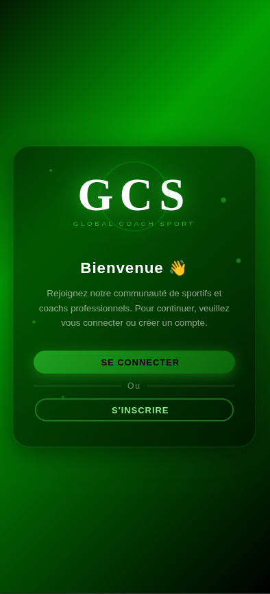
  <br/><br/>
  <i>✨ Écran de bienvenue — Rejoignez la communauté GCS</i>
</div>

<br/>

> 🟢 L'écran d'accueil présente le logo **GCS**, un message de bienvenue chaleureux et deux actions principales : **Se connecter** ou **S'inscrire**. Le design sobre sur fond vert foncé donne une identité forte et sportive à l'application.

<br/>

---

### 🔑 Page de connexion

<div align="center">
  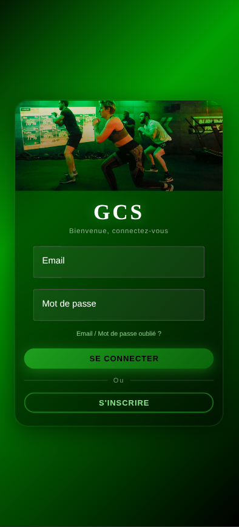
  <br/><br/>
  <i>🔐 Connexion sécurisée par email &amp; mot de passe</i>
</div>

<br/>

> 🟢 L'écran de connexion intègre une image de contexte sportif en haut, suivi des champs **Email** et **Mot de passe**. Une option *"Email / Mot de passe oublié ?"* est disponible. Depuis cet écran, l'utilisateur peut aussi accéder directement à l'inscription.

<br/>

---

### 📝 Page d'inscription

<div align="center">
  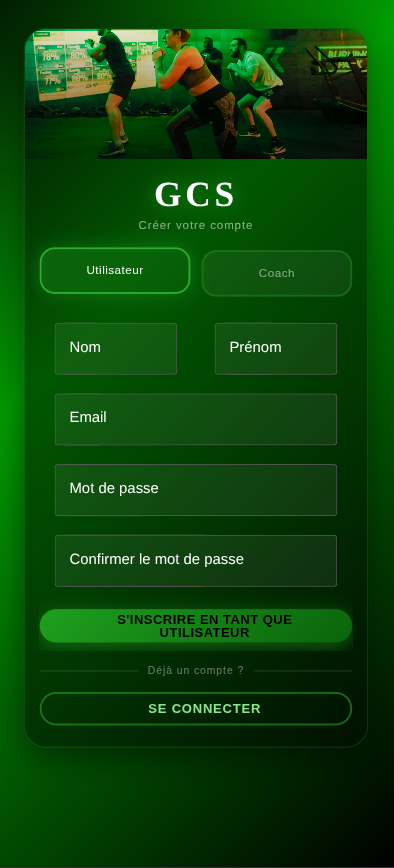
  &nbsp;&nbsp;&nbsp;&nbsp;
  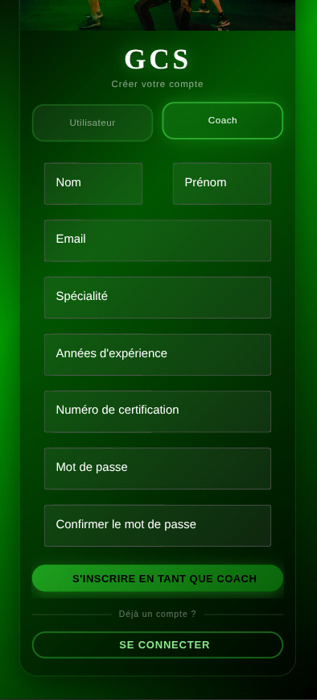
  <br/><br/>
  <i>👤 Compte Utilisateur &nbsp;&nbsp;&nbsp;|&nbsp;&nbsp;&nbsp; 🧑‍🏫 Compte Coach</i>
</div>

<br/>

> 🟢 L'inscription propose deux profils distincts via un **toggle Utilisateur / Coach** :
> - **Utilisateur** : Nom, Prénom, Email, Mot de passe
> - **Coach** : Nom, Prénom, Email, Spécialité, Années d'expérience, Numéro de certification, Mot de passe

<br/>

---

### 👤 Espace Utilisateur

<div align="center">
  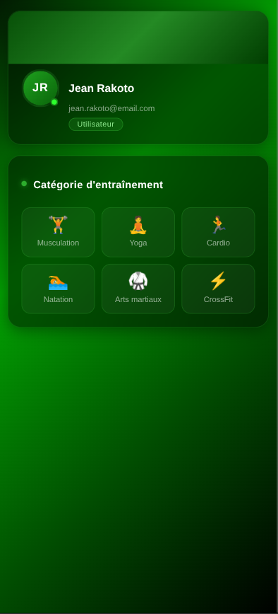
  &nbsp;&nbsp;
  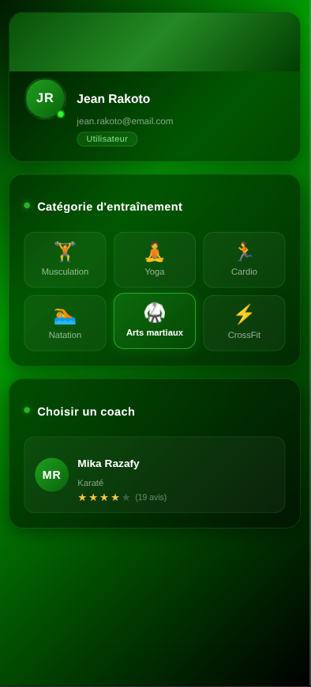
  <br/><br/>
  <i>🏅 Choix de catégorie &nbsp;&nbsp;&nbsp;|&nbsp;&nbsp;&nbsp; 🤝 Sélection du coach</i>
  <br/><br/>
  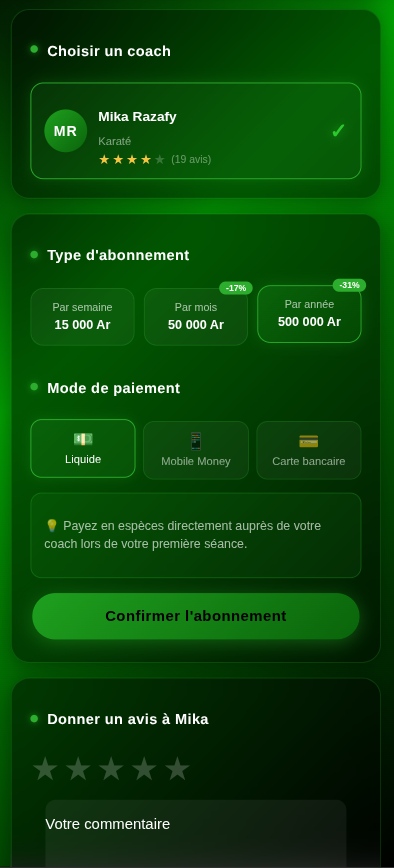
  &nbsp;&nbsp;
  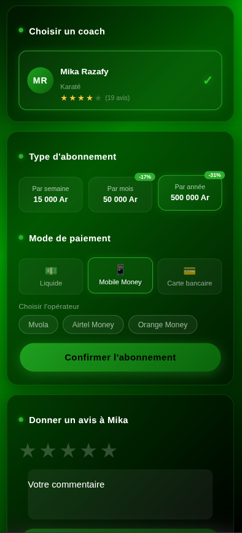
  &nbsp;&nbsp;
  
  <br/><br/>
  <i>💵 Liquide &nbsp;&nbsp;|&nbsp;&nbsp; 📱 Mobile Money &nbsp;&nbsp;|&nbsp;&nbsp; 💳 Carte bancaire</i>
</div>

<br/>

> 🟢 L'utilisateur choisit sa **catégorie d'entraînement** parmi 6 disciplines, puis sélectionne un **coach disponible** selon ses avis et sa spécialité. Il configure ensuite son **abonnement** et son **mode de paiement** préféré.

<br/>

<div align="center">

<h4>💰 Tarifs d'abonnement</h4>

<table>
  <thead>
    <tr>
      <th>Durée</th>
      <th>Prix</th>
      <th>Économie</th>
    </tr>
  </thead>
  <tbody>
    <tr>
      <td>📅 Par semaine</td>
      <td>15 000 Ar</td>
      <td>—</td>
    </tr>
    <tr>
      <td>🗓️ Par mois</td>
      <td>50 000 Ar</td>
      <td>-17%</td>
    </tr>
    <tr>
      <td>📆 Par année</td>
      <td>500 000 Ar</td>
      <td>-31%</td>
    </tr>
  </tbody>
</table>

</div>

<br/>

---

### 🧑‍🏫 Espace Coach

<div align="center">
  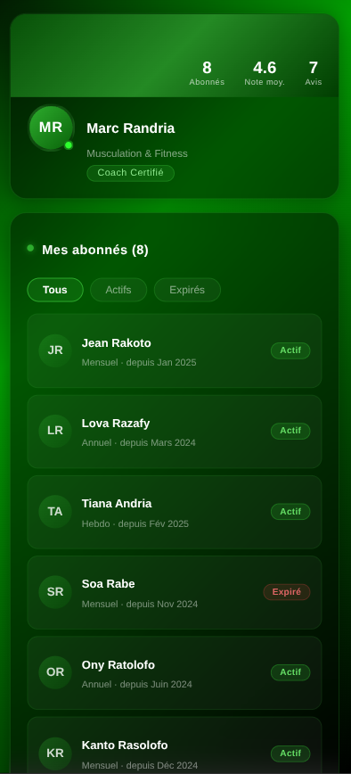
  &nbsp;&nbsp;
  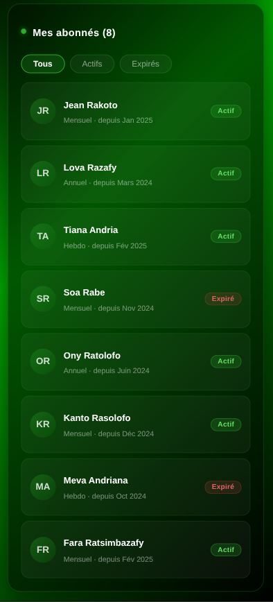
  &nbsp;&nbsp;
  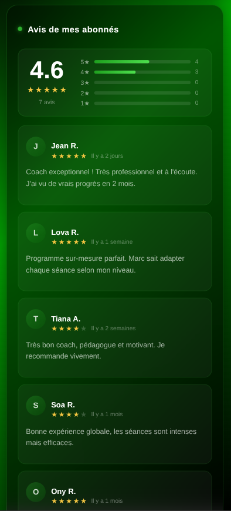
  <br/><br/>
  <i>📊 Tableau de bord &nbsp;&nbsp;|&nbsp;&nbsp; 📋 Mes abonnés &nbsp;&nbsp;|&nbsp;&nbsp; ⭐ Mes avis</i>
</div>

<br/>

> 🟢 Le coach dispose d'un **tableau de bord complet** affichant ses statistiques clés (nombre d'abonnés, note moyenne, nombre d'avis), la **liste filtrée de ses abonnés** (Tous / Actifs / Expirés), et une **section dédiée aux avis** reçus avec notation étoiles.

<br/>

---

## 🚀 Fonctionnalités principales

<br/>

<table>
  <tr>
    <td width="50%" valign="top">
      <h3>👤 Côté Utilisateur</h3>
      ✅ Inscription &amp; connexion sécurisée<br/>
      ✅ Choix de la catégorie sportive<br/>
      ✅ Sélection d'un coach certifié<br/>
      ✅ Abonnement semaine / mois / année<br/>
      ✅ 3 modes de paiement disponibles<br/>
      ✅ Dépôt d'avis et commentaires
    </td>
    <td width="50%" valign="top">
      <h3>🧑‍🏫 Côté Coach</h3>
      ✅ Inscription avec certification<br/>
      ✅ Tableau de bord avec statistiques<br/>
      ✅ Gestion des abonnés (actifs/expirés)<br/>
      ✅ Consultation des avis reçus<br/>
      ✅ Note moyenne calculée automatiquement<br/>
      ✅ Profil public visible par les utilisateurs
    </td>
  </tr>
</table>

<br/>

---

## 🛠️ Stack technique

<br/>

<div align="center">

<table>
  <thead>
    <tr>
      <th>Couche</th>
      <th>Technologie</th>
      <th>Version</th>
    </tr>
  </thead>
  <tbody>
    <tr>
      <td>📱 Framework mobile</td>
      <td>Ionic</td>
      <td>6+</td>
    </tr>
    <tr>
      <td>🅰️ Framework front-end</td>
      <td>Angular</td>
      <td>17+</td>
    </tr>
    <tr>
      <td>🔷 Langage principal</td>
      <td>TypeScript</td>
      <td>5+</td>
    </tr>
    <tr>
      <td>🎨 Styles</td>
      <td>HTML5 / CSS3 / SCSS</td>
      <td>—</td>
    </tr>
    <tr>
      <td>📦 Gestionnaire de paquets</td>
      <td>npm</td>
      <td>—</td>
    </tr>
  </tbody>
</table>

</div>

<br/>

---

## 📖 Manuel d'utilisation

<br/>

### ⚙️ Prérequis

Avant de lancer le projet, assurez-vous d'avoir installé :

```bash
# Node.js (v18 ou supérieur recommandé)
node --version

# Ionic CLI
npm install -g @ionic/cli

# Vérifier l'installation
ionic --version
```

<br/>

### 📥 Installation des dépendances

```bash
# Cloner le projet
git clone <url-du-repo>

# Naviguer dans le dossier
cd GCS

# Installer les dépendances
npm install
```

<br/>

### ▶️ Lancer le projet

```bash
ionic serve
```

> 💡 Une page web s'ouvrira automatiquement dans votre navigateur.
> Si ce n'est pas le cas, rendez-vous sur : **http://localhost:8100**

<br/>

### 📁 Structure du projet

```
GCS/
├── src/
│   ├── app/               # Pages & composants Angular
│   ├── assets/
│   │   ├── icon/          # Icônes de l'app
│   │   ├── img/           # Images générales
│   │   └── sources/       # Captures d'écran (README)
│   ├── environments/      # Config environnements
│   └── theme/             # Thème global (variables SCSS)
├── ionic.config.json
└── package.json
```

<br/>

---

## 🎯 Objectif du projet

<br/>

<div align="center">

<pre>
╔══════════════════════════════════════════════════════════╗
║                                                          ║
║   Faciliter la mise en relation entre SPORTIFS           ║
║   et COACHS PROFESSIONNELS, tout en simplifiant          ║
║   la gestion des abonnements et des interactions         ║
║   au sein d'un club sportif moderne. 🏆                  ║
║                                                          ║
╚══════════════════════════════════════════════════════════╝
</pre>

</div>

<br/>

---

<div align="center">


<br/><br/>

<i>© 2025 GCS — Global Coach Sport. Tous droits réservés.</i>

<br/>

</div>
